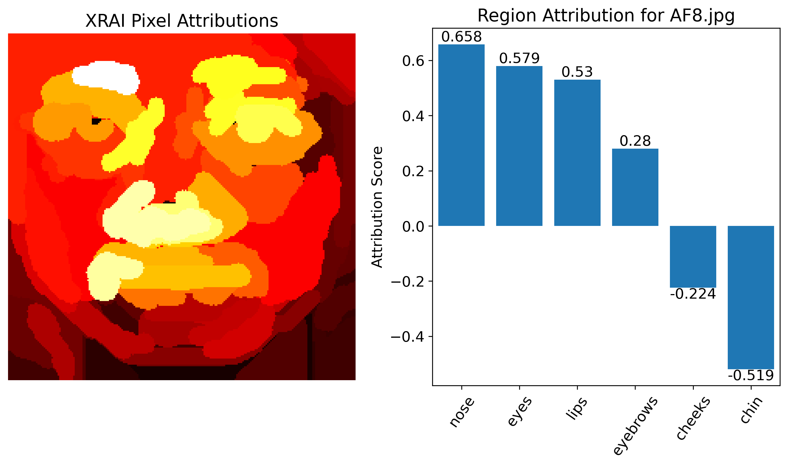
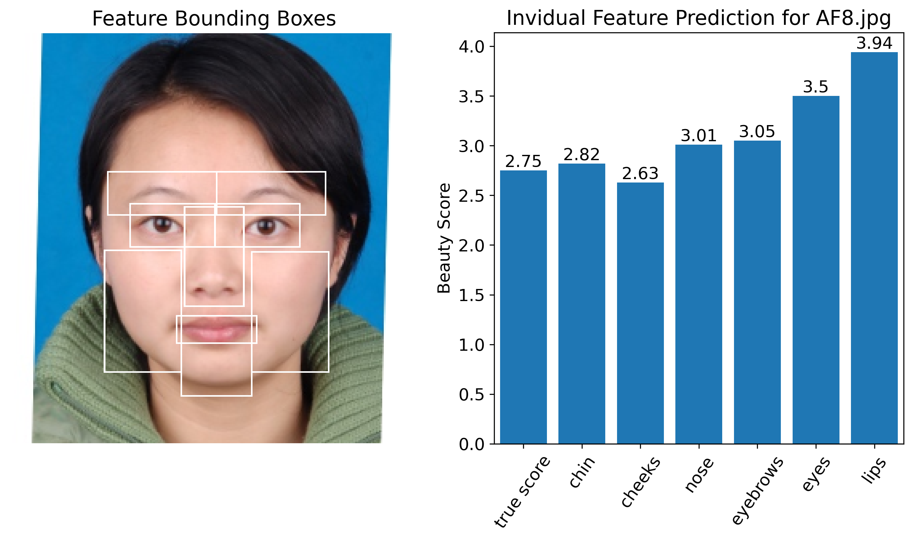

# Is Facial Beauty in the Eyes? A Multi-Method Approach to Interpreting Facial Beauty Prediction in Machine Learning Models

## Overview
This project explores the contributions of specific facial regions to overall beauty assessments using machine learning models. We employ multiple interpretability methods, including permutation feature importance, XRAI (eXplanation with Ranked Area Integrals), and individual feature prediction to analyze these contributions.

## Datasets
We perform experiments on the following datasets:
1. **MEBeauty**: [MEBeauty Database](https://github.com/fbplab/MEBeauty-database)
2. **SCUTFBP-5500**: [SCUT-FBP5500 Database](https://github.com/HCIILAB/SCUT-FBP5500-Database-Release)

## Preprocessing
The datasets are preprocessed using Mediapipe for face detection, alignment, and keypoint detection. For more details, refer to `cropping.py`.

- Mediapipe Face Landmarker: [Mediapipe Face Detection](https://ai.google.dev/edge/mediapipe/solutions/vision/face_landmarker)

## Interpretability Methods

### 1. XRAI Region Attribution
XRAI aims to explain each pixel of the input image's contribution to the overall prediction of the model. See `xrai.ipynb` and `region_attribution.ipynb`

### 2. Permutation Importance
Permutation importance assesses the importance of each facial region by randomly permuting the region across the dataset and measuring the resulting decrease in model performance on the testing dataset. See `permutation.ipynb`

### 3. Individual Feature Prediction
We train separate models on each region of interest of the face and compare the importance of each feature based on the generalizability of its respective model. See `individual_regions.ipynb`

## Contact
For any questions or feedback, please contact Ahmed Aman Ibrahim at ahmedamanibrahim@gmail.com or Noah Hassan Ugail at ugailnoah@gmail.com